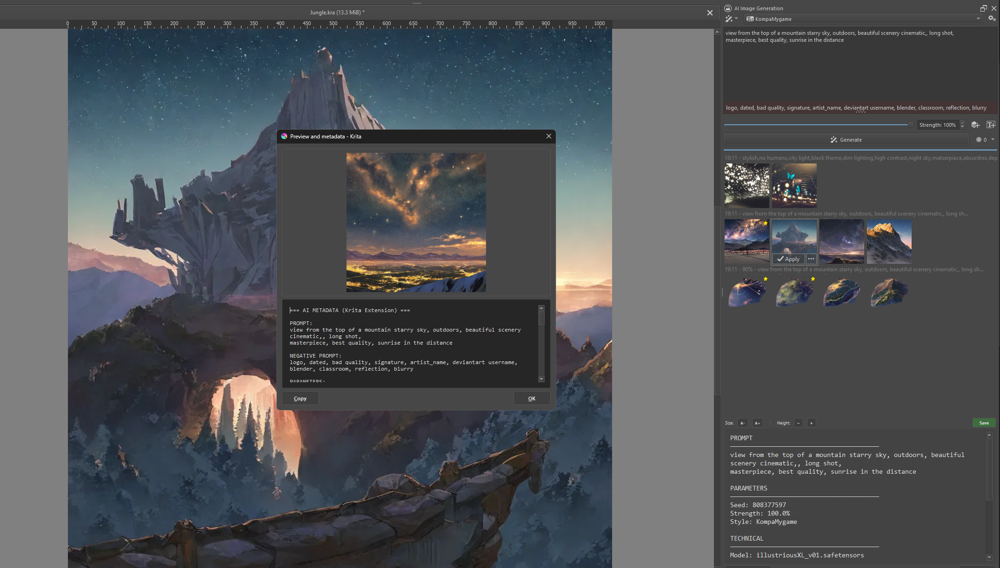
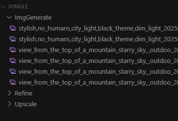
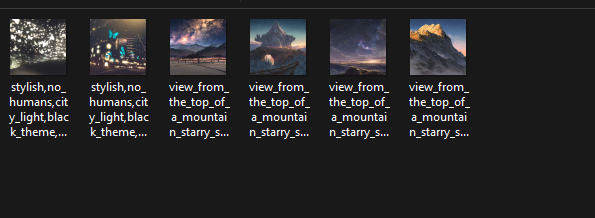
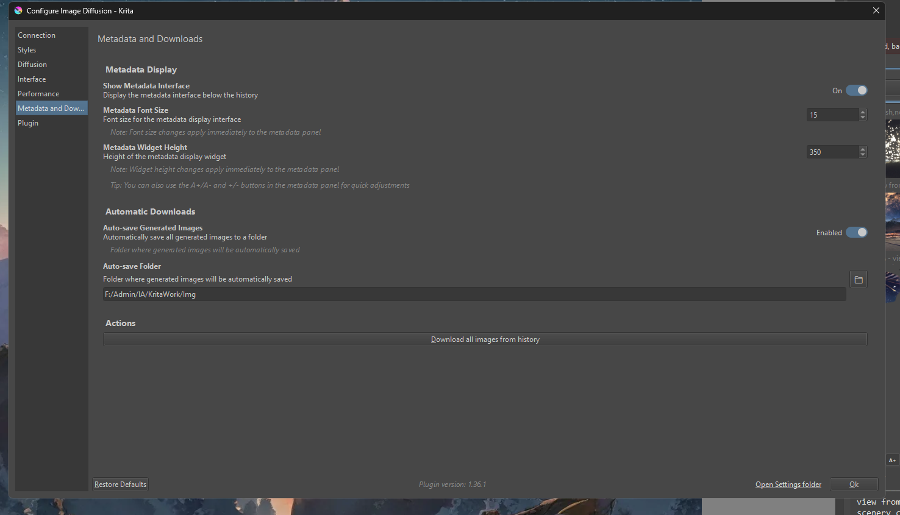

# krita-ai-diffusion-Metadata-And-Downloads

**krita-ai-diffusion-Metadata-And-Downloads** is an unofficial extension designed to enhance the **Krita AI Diffusion** plugin.  
It adds useful features to display metadata from generated images and automatically save these images to a dedicated folder.

---

## ⚠️ Disclaimers

- This project was initially developed for **personal use only**.
- It has been made available on GitHub due to interest from several users.
- **Part of the code was generated with the help of an AI.**
- **There is no guarantee of long-term maintenance or support.**
- This project is **completely independent** and **not affiliated** with the official developers of **Krita AI Diffusion**.

---

## ✨ Features

- **Metadata display**  
  Allows you to view the metadata of images generated by Krita AI Diffusion. You can also select any local image to inspect its metadata.

- **Automatic saving**  
  All images generated through Krita AI are automatically saved to a global, configurable folder.

- **Metadata preservation**  
  Saved files include AI process metadata.  
  A green "save" button allows you to manually save the final image if needed.

---

## 🛠 Installation Guide

> 🔧 **Important:** This extension has only been tested with **Krita AI Diffusion version 1.36.1**.

### 1. Prepare Krita AI Diffusion

- Download and install Krita AI Diffusion version `1.36.1` on a clean setup.
- [Official Krita AI Diffusion GitHub Project](https://github.com/Acly/krita-ai-diffusion/releases/tag/v1.36.0)

### 2. Download the Extension

- Get the latest version of this extension from the [Releases](https://github.com/NatsukiYuri/krita-ai-diffusion-Metadata-And-Downloads/releases/tag/0.1) tab of this GitHub repository.

### 3. Add the Files

- Open the Krita installation directory where AI Diffusion is located.  
  📁 Example path: `C:\Users\USERNAME\AppData\Roaming\krita\pykrita`

- Drag and drop the content of this extension into the `pykrita` folder, at the same level as the `ai_diffusion` folder.  
  Confirm file replacement when prompted.

### 4. Restart Krita

- Restart Krita. The extension should now be active.

### 5. Configure Settings

- In Krita, go to the extension settings and customize the options in the **Metadata And Downloads** tab.  
  _(Some settings may require restarting Krita to take effect.)_

---

## 📸 Previews

### Interface – Metadata Viewer

### Example – Auto-save Folder

### Settings Tab

---

## 📞 Contact

Feel free to reach out on Discord: `natsu62`  
I'm available to answer questions or provide guidance.
